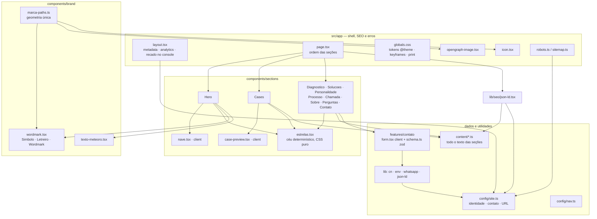
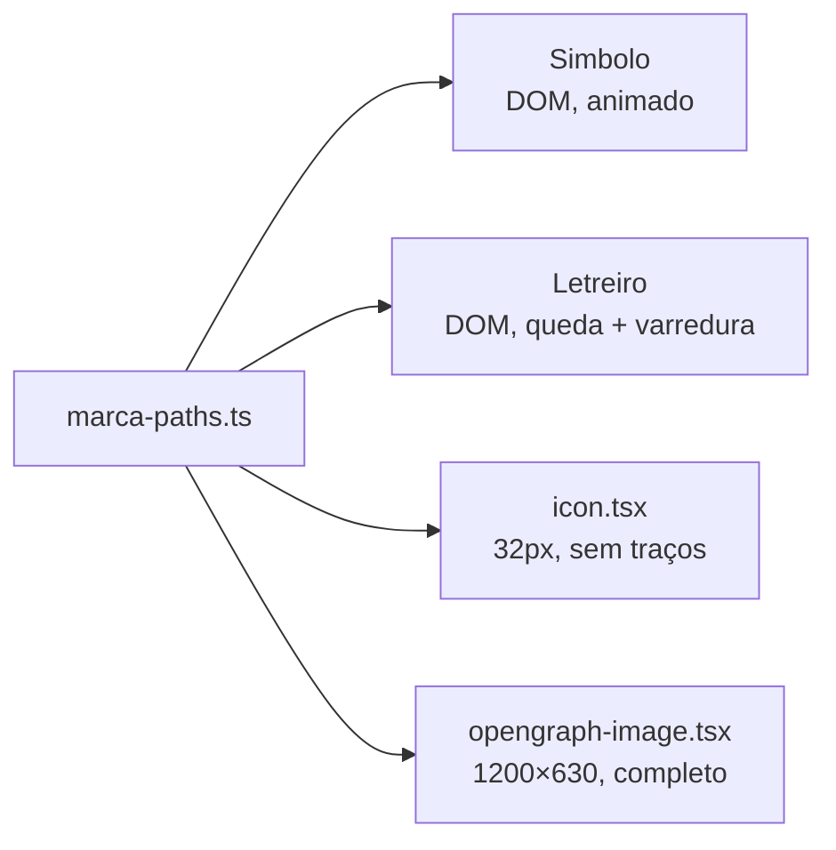
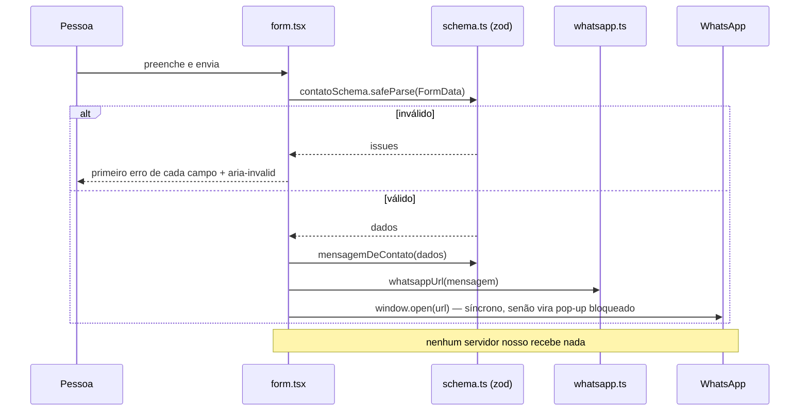
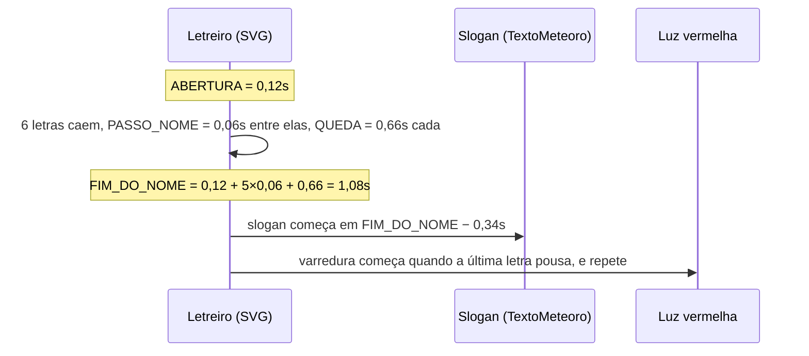

# Mapa do código — DETERA

> Gerado pelo Cartographer. Último mapeamento: 22/09/2026, 23:35 UTC.

Site institucional de página única da DETERA. Next.js 16 (App Router + Turbopack), React 19, TypeScript estrito, Tailwind CSS v4, e GSAP + ScrollTrigger + Lenis (pelo npm) para a rolagem cinematográfica da versão premium. Tudo é pré-renderizado estático; não existe backend, rota de API nem banco. O formulário de contato monta a mensagem e abre o WhatsApp — nada sai do navegador para um servidor nosso.

## Visão geral



A dependência corre num sentido só: `page → sections → ui/brand → content/config/lib`. Nada em `content/`, `config/` ou `lib/` importa de `components/`.

## Estrutura de diretórios

```
detera/
├── next.config.ts          # CSP, headers de segurança, redirects das URLs antigas — função da fase, não do NODE_ENV
├── README.md               # decisões de marca e produto
├── .env.example            # NEXT_PUBLIC_SITE_URL, NEXT_PUBLIC_WHATSAPP_NUMBER
├── public/
│   ├── cases/              # fotos dos cases, copiadas (não hotlinkadas)
│   └── fonts/              # Oxanium variável, latin + latin-ext (woff2)
├── docs/
│   └── CODEBASE_MAP.md     # este arquivo
└── src/
    ├── app/                # layout, página, CSS global, erros, favicon, imagem OG, robots, sitemap
    ├── components/
    │   ├── brand/          # a marca: geometria, símbolo, nome desenhado, texto em meteoro
    │   ├── layout/         # header (client) e footer
    │   ├── motion/         # coreografias de rolagem (client): Lenis, hero fixado, manifesto, revelações
    │   ├── sections/       # uma seção por arquivo + estrelas + nave + prévia de case
    │   └── ui/             # button, botao-nucleo, container, section, ícones
    ├── config/             # site.ts (identidade e contato) e nav.ts
    ├── content/            # todo o texto das seções, separado da apresentação
    ├── features/contato/   # formulário + schema zod + montagem da mensagem
    └── lib/                # motion.ts (registro do GSAP, Lenis), seo/json-ld e utils (cn, env, whatsapp)
```

Fora do produto: `.claude/launch.json` (servidor do preview) e a skill `frontend-design`, instalada via `npx skills` — versionada em `.agents/skills/` com o `skills-lock.json`. `.claude/skills/` é uma junção do Windows para lá, fora do Git; em outra máquina, `npx skills add https://github.com/anthropics/skills --skill frontend-design` recria.

## Guia por módulo

### `src/app/` — shell, SEO e erros

| Arquivo | Função | Tokens |
|---|---|---|
| `layout.tsx` | HTML raiz, `metadata`, `viewport`, Vercel Analytics/Speed Insights, recado no console | 1098 |
| `page.tsx` | Compõe a página inteira, na ordem do argumento de venda | 448 |
| `globals.css` | Tokens `@theme`, `@font-face` da Oxanium, todas as classes e keyframes, bloco de impressão | 9996 |
| `error.tsx` | Erro de segmento (client). Mostra só o `digest`, nunca a pilha | 568 |
| `global-error.tsx` | Erro no próprio layout (client). Cores fixas em linha — o CSS pode não ter carregado | 591 |
| `not-found.tsx` | 404 com `noindex` | 340 |
| `icon.tsx` | Favicon 32px via `next/og`, subconjunto da geometria (sem os traços) | 420 |
| `opengraph-image.tsx` | Imagem de compartilhamento 1200×630 com símbolo, nome desenhado, slogan e as quatro frentes | 1052 |
| `robots.ts` / `sitemap.ts` | Bloqueiam tudo sem domínio público; sitemap de uma URL só | 248 |

**Ordem da página** (`page.tsx`): link "Pular para o conteúdo" → `Header` → `Hero` → `Cases` → `Diagnostico` → `Solucoes` → `Personalidade` → `Processo` → `Chamada` → `Sobre` → `Perguntas` → `Contato` → `Footer` → `EmpresaJsonLd` + `PerguntasJsonLd`. O comentário do arquivo descreve a narrativa: marca → prova → problema reconhecível → o que fazemos → por que temos cara própria → como funciona → chamada → quem somos → objeções → contato.

### `src/components/brand/` — a marca

| Arquivo | Função | Tokens |
|---|---|---|
| `marca-paths.ts` | Fonte única da geometria: `NOME_DETERA` (6 letras traçadas à mão), `NOME_DETERA_VIEWBOX` (`0 0 716 202`), `ALTURA_LETRAS` (128), `MARCA_METADE`, `MARCA_NUCLEO`, `MARCA_LINHA`, `MARCA_TRACOS` (sistema `0 0 32 40`) | 1299 |
| `wordmark.tsx` | `Simbolo` (coração de placas, metade direita espelhada), `Letreiro` (o nome desenhado; com `animado`, queda letra a letra, luz vermelha e o símbolo pequeno sob o "A"), `Wordmark` (símbolo + nome, rodapé) | 2192 |
| `texto-meteoro.tsx` | `TextoMeteoro`: texto que cai letra a letra, quebrando por palavra, com cópia `sr-only` | 671 |

Nenhum é client. O movimento da marca (placas respirando, núcleo pulsando, traços piscando) é só CSS (`.marca-viva`).



Os três destinos não compartilham runtime — só esse arquivo. Mudou a marca, confere os três.

### `src/components/layout/`

| Arquivo | Função | Tokens |
|---|---|---|
| `header.tsx` | Cabeçalho fixo, só o símbolo, menu mobile, CTA de WhatsApp. Client por causa do menu (estado, trava de rolagem, Escape) | 1249 |
| `footer.tsx` | Assinatura completa, navegação, canais, redes, linha legal. Fecha a trilha (`trilha--fim`) | 1143 |

O menu mobile usa `hidden={!menuAberto}` em vez de desmontar: os links continuam no HTML entregue, visíveis para buscador.

### `src/components/sections/`

| Arquivo | Função | Conteúdo | Tokens |
|---|---|---|---|
| `hero.tsx` | Hero em 100svh, fixado por `HeroCena`: nome caindo (ao carregar), desfeito letra a letra na rolagem; o coração sob o "A" vai ao centro e acende. Slogan, CTAs, trilha das frentes, céu, auras, jogo na margem | `pilares`, `site.slogan` | 2097 |
| `nave.tsx` | Jogo de nave em canvas na margem esquerda (≥1680px). Client | — | 4489 |
| `estrelas.tsx` | Céu de fundo: estrelas, cadentes, cometas, nebulosa. PRNG xorshift com semente por seção | — | 2545 |
| `cases.tsx` | Os dois cases (com notas medidas do PageSpeed) + "Também em obra" | `cases`, `em-construcao` | 2575 |
| `case-preview.tsx` | Moldura de navegador: fotos em rodízio, iframe isolado ou aviso. Client (fallback de erro) | tipo `ImagemPrevia` | 1907 |
| `diagnostico.tsx` | Os quatro sintomas | `diagnostico` | 388 |
| `solucoes.tsx` | As quatro frentes e suas entregas, CTA de WhatsApp por frente | `pilares` | 1041 |
| `personalidade.tsx` | O momento marcante: fixada por `ManifestoCena`, cada frase genérica recua e a específica se resolve do blur ao nítido. Sem movimento, é a lista genérico × específico | `personalidade` | 751 |
| `processo.tsx` | Cinco etapas numeradas + o laço `05 → 01` desenhado na rolagem | `processo` | 1403 |
| `chamada.tsx` | Bloco de decisão no meio da página | texto próprio | 670 |
| `sobre.tsx` | Por que a DETERA existe + fundador | `site` | 1031 |
| `perguntas.tsx` | FAQ em `<details>` nativo | `perguntas` | 677 |
| `contato.tsx` | Canais + formulário | `site`, `features/contato` | 932 |

**Volume dos títulos** (três degraus, pelo peso do que a seção diz): `text-display` em Soluções e Sobre; `text-subdisplay` em Cases, Diagnóstico, Personalidade e Contato; `text-title` em Processo e Perguntas.

**Densidade do céu** (`<Estrelas quantidade>`): hero 96, contato 72, diagnóstico 48, personalidade 44, chamada 38, sobre 40, cases 30, soluções 22, processo 20, perguntas 16. É uma curva: forte nos momentos, quase apagado onde se lê muito.

### `src/components/motion/` — a coreografia da rolagem

Todos client, todos com `useGSAP` e `gsap.matchMedia(COM_MOVIMENTO)`: com movimento reduzido nada é criado e o HTML do servidor vale como está. Recebem o conteúdo como `children` e acham o que animar por `data-*`, não por classe de estilo.

| Arquivo | Função |
|---|---|
| `smooth-scroll.tsx` | Lenis ligado ao ticker do GSAP (uma vez no `layout.tsx`); âncoras rolam pelo Lenis e levam o foco junto |
| `hero-cena.tsx` | Pin #1 (`+=90%`, só em tela ≥ 768 × 640): desfaz `[data-letra-desfaz]`, leva `[data-hero-coracao]` ao centro, avança o céu. Abaixo disso, desfaz sem pin. Marco `data-fim-do-hero` para o cabeçalho |
| `manifesto-cena.tsx` | Pin #2 (`+=320%`): põe `.manifesto--palco` e roda os quatro pares + fecho |
| `contador.tsx` | Nota do PageSpeed contando até o valor medido (o HTML já traz o final) |
| `revelar.tsx` | Bloco que abre do centro por `clip-path` (Chamada). A tela das prévias faz o mesmo dentro de `case-preview.tsx` |
| `filete.tsx` | Linha que se desenha por `scaleX` (Diagnóstico) |
| `linha-viva.tsx` | Linha vermelha das etapas do Processo e nós que acendem |

Os dois únicos trechos fixados da página são o hero e o manifesto — a regra é no máximo dois.

### `src/components/ui/`

| Arquivo | Função | Tokens |
|---|---|---|
| `button.tsx` | `Button`, `ButtonLink` (escolhe `<a>` ou `next/link` pelo href), `buttonStyles`; os estados vivem em `.btn*` no CSS | 669 |
| `botao-nucleo.tsx` | O CTA com brilho que segue o ponteiro (`--mx`/`--my`). Client. Reservado para 2–3 CTAs | 409 |
| `container.tsx` | Largura: narrow 44rem, default 76rem, wide 88rem | 191 |
| `section.tsx` | Fundo (`vazio`/`camada`), respiro vertical, trilha, `alias` para âncoras antigas | 478 |
| `icones.tsx` | Seis ícones desenhados à mão, sem biblioteca | 950 |

### `src/config/`

| Arquivo | Função | Tokens |
|---|---|---|
| `site.ts` | `site` (nome, slogan, contato, fundador, URL), `isPublicDomain`, `resolveSiteUrl()` | 703 |
| `nav.ts` | `navLinks`, usado por header e footer | 169 |

### `src/content/` — todo o texto

| Arquivo | Exporta | Usado por | Tokens |
|---|---|---|---|
| `cases.ts` | `Case`, `Medicao`, `ImagemPrevia`, `cases` | `cases.tsx`, `case-preview.tsx` | 2157 |
| `pilares.ts` | `Pilar`, `Entrega`, `pilares` | `hero.tsx`, `solucoes.tsx`, `json-ld.tsx` | 1830 |
| `processo.ts` | `etapas` | `processo.tsx` | 420 |
| `perguntas.ts` | `perguntas` | `perguntas.tsx`, `json-ld.tsx` | 590 |
| `diagnostico.ts` | `sintomas` | `diagnostico.tsx` | 316 |
| `personalidade.ts` | `transformacoes` | `personalidade.tsx` | 340 |
| `em-construcao.ts` | `ProjetoEmConstrucao`, `projetosEmConstrucao` | `cases.tsx` | 507 |

`pilares[].acento` decide a cor: só `infraestrutura` é `sistema` (azul) — "a única frente que não vende movimento, e sim permanência". `cases[].medicao` guarda as notas do PageSpeed com o link permanente do relatório.

### `src/features/contato/`

| Arquivo | Função | Tokens |
|---|---|---|
| `schema.ts` | `contatoSchema` (zod, limite superior em todo campo), `tiposDeProjeto`, `mensagemDeContato()` | 572 |
| `form.tsx` | `FormularioContato`: valida no cliente e abre o WhatsApp. Client | 1097 |

### `src/lib/`

| Arquivo | Função | Tokens |
|---|---|---|
| `seo/json-ld.tsx` | `EmpresaJsonLd` (`ProfessionalService` com catálogo vindo de `pilares`) e `PerguntasJsonLd` (`FAQPage`); `serializar()` escapa `<` | 789 |
| `utils/cn.ts` | Junta classes e resolve conflito de Tailwind com `twMerge` | 166 |
| `utils/env.ts` | `env()`: string vazia conta como ausente (é assim que a Vercel entrega variável declarada e não preenchida) | 90 |
| `utils/whatsapp.ts` | `whatsappUrl(texto)` → `https://wa.me/{numero}?text=…` | 112 |

## Fluxos

### Contato



Todo CTA do site (header, hero, soluções, chamada, footer, contato) monta o seu próprio `whatsappUrl(...)` com uma mensagem diferente, para a conversa já começar sabendo de onde a pessoa veio.

### Entrada do hero



`QUEDA` em `hero.tsx` tem que bater com a duração de `meteoro-cai` no CSS.

## Tokens de design (`globals.css`, `@theme`)

**Cores**
- Superfícies: `vazio #07080b`, `camada #0e1015`, `camada-alta #161920`, `borda #23262e`, `borda-viva #363b45`, `contorno #5c626d` (borda de elemento interativo, separada da decorativa para cumprir o contraste 3:1 da WCAG 1.4.11).
- Texto: `texto #f2f3f5`, `texto-suave #9ba1ac`, `texto-fraco #767c88`.
- Determinação (ação, núcleo): `determinacao #ff3b3b`, `-viva #ff6b6b`, `-funda #3d0f14`.
- Sistema (infraestrutura, continuidade): `sistema #4c7dff`, `-viva #7ca0ff`, `-funda #10203f`.

**Fonte**: Oxanium para `--font-display`, `--font-sans` e `--font-mono`, variável 200–800, servida de `public/fonts` por `@font-face`.

**Escala**: `marca` → `display` (60px) → `subdisplay` (48px) → `title` (36px) → `heading` → `lead` → `micro`.

**Forma e ritmo**: `--radius-min 2px`, `--radius-bloco 4px`; `--ease-decidido cubic-bezier(0.2, 0.8, 0.2, 1)`.

**Classes que importam**

| Classe / keyframe | Função |
|---|---|
| `.trilha`, `.trilha--fim` | Linha vertical com nó que atravessa a página (≥1280px) |
| `.bloco`, `.bloco--vivo` | Card com borda; variante com hover |
| `.btn--*` | Variantes e estados de botão |
| `.estado` | Rótulo curto de estado real (placar, "Em obra", 404) — não usar como etiqueta decorativa |
| `.campo` | Campo de formulário, com estado `aria-invalid` |
| `.aura` | Brilho radial parado, parametrizado por `--aura-*` (a do hero é conduzida pela rolagem) |
| `.estrela`, `.cadente`, `.cometa` | O céu. A camada não deriva mais em loop; onde anda, é a rolagem que move |
| `.manifesto--palco`, `.manifesto__*` | Layout do manifesto fixado, só em `@media screen` |
| `.marca-viva` e filhas | A marca viva |
| `.meteoro`, `.letra-meteoro`, `.letreiro-relevo`, `.marca-varredura` | Entrada do nome e do slogan |
| `.entrar` | Entrada do hero, por tempo |
| `[data-surgir]` | Revelação por rolagem, `animation-timeline: view()` |
| `.ciclo-volta` | O laço do processo, revelado por `clip-path` na rolagem |
| `.previa-slide`, `.obra-*` | Rodízio de fotos e recados de obra |
| `.pular-conteudo` | Link de pular para o conteúdo |

**Movimento reduzido**: uma regra global zera duração e atraso de toda animação e transição. Qualquer animação nova já fica coberta — e o que se vê com movimento reduzido é o estado final.

**Impressão**: a linha do tempo de rolagem nunca anda no papel. O bloco `@media print` força `[data-surgir]`, `.entrar`, `.meteoro`, `.letra-meteoro` e `.ciclo-volta` visíveis, tira o `clip-path` do laço, esconde céu, auras e varredura, e deixa só a primeira foto do rodízio.

## Segurança e infraestrutura

`next.config.ts` exporta uma função da **fase** do Next (`PHASE_DEVELOPMENT_SERVER`), não um objeto que lê `NODE_ENV` — uma versão antiga assim vazou `'unsafe-eval'` para produção.

| Diretiva | Valor | O que isso impõe ao código |
|---|---|---|
| `script-src` | `'self' 'unsafe-inline'` (+ `'unsafe-eval'` e Vercel só em dev) | Scripts em linha permitidos sem nonce (nonce exigiria middleware e mataria o estático). Os dois scripts próprios — recado do console e JSON-LD — escapam `<` |
| `style-src` | `'self' 'unsafe-inline'` | Estilo em linha liberado (variáveis CSS via `style`) |
| `img-src` | `'self' data: https://yasmin-g-studio.vercel.app` | Imagem externa só dessa origem; o resto vai para `public/` |
| `font-src` | `'self'` | Fonte tem que ser auto-hospedada |
| `frame-src` | `https://keepnew.vercel.app` | Único iframe permitido |
| `connect-src` | `'self'` (+ `ws:`/`wss:` em dev) | Nenhum fetch para terceiros |
| `form-action`, `base-uri` | `'self'` | — |
| `object-src`, `frame-ancestors` | `'none'` | O site não pode ser embutido |

Outros headers: `X-Content-Type-Options: nosniff`, `Referrer-Policy: strict-origin-when-cross-origin`, `X-Frame-Options: DENY`, `Permissions-Policy` restritiva, `Strict-Transport-Security: max-age=63072000; includeSubDomains` — **sem `preload`**, de propósito (entrar na lista é praticamente irreversível).

Redirects temporários (307, não 308, para o navegador não cachear uma decisão ainda em ajuste): `/sobre`, `/servicos`, `/solucoes`, `/projetos`, `/como-funciona`, `/processo`, `/contato` → âncoras da home.

## Variáveis de ambiente

| Variável | Lida em | Sem ela |
|---|---|---|
| `NEXT_PUBLIC_SITE_URL` | `config/site.ts` | `isPublicDomain = false` → `noindex` em `layout.tsx` e `disallow: /` em `robots.ts`. **O site não é indexado** |
| `NEXT_PUBLIC_WHATSAPP_NUMBER` | `config/site.ts` | Cai em `5562984750989`, fixo no código |
| `VERCEL_PROJECT_PRODUCTION_URL` | `config/site.ts` | Injetada pela Vercel; senão `http://localhost:3000` |

Toda leitura passa por `env()`, que trata string vazia como ausente.

## Código que roda no cliente

| Componente | Por quê |
|---|---|
| `app/error.tsx`, `app/global-error.tsx` | Error boundary do Next tem que ser client |
| `layout/header.tsx` | Menu mobile: estado, trava de rolagem, Escape |
| `ui/botao-nucleo.tsx` | Posição do ponteiro em variáveis CSS |
| `sections/nave.tsx` | Canvas, `requestAnimationFrame`, teclado, `ResizeObserver` |
| `sections/case-preview.tsx` | Fallback quando a imagem ou o iframe falha; a tela abre do centro na rolagem |
| `components/motion/*` | Lenis e as coreografias do GSAP |
| `features/contato/form.tsx` | Validação e `window.open` |

Todo o resto — a marca, o céu, as seções, os botões — é renderizado no servidor, sem JavaScript no cliente.

## Convenções

- **Português em tudo**: identificadores, props, campos de conteúdo e comentários (`Simbolo`, `criarGerador`, `entregas`, `acento`). Só os primitivos de UI ficam em inglês (`Button`, `Container`, `Section`).
- **Comentário explica a alternativa rejeitada**: o padrão dominante é "antes era X, deu Y, por isso Z". Leia o comentário antes de "simplificar" algo que parece estranho.
- **Texto fora do componente**: cada seção é um renderizador fino sobre um arquivo de `src/content/`.
- **Aleatoriedade determinística**: nunca `Math.random()` no que roda no servidor. `estrelas.tsx` usa xorshift com semente por seção. (`nave.tsx` pode usar `Math.random()` — roda só no cliente, depois do clique.)
- **React → CSS por variável**: parâmetros de animação entram via `style={{ "--x": … }}` e a classe no CSS consome.
- **HTML nativo antes de widget**: `<details>` no FAQ e na história do case, `<dl>` nas notas, `<ol>` só onde a ordem importa.
- **Acessibilidade**: `aria-hidden` em toda decoração; `sr-only` para o texto que cai letra a letra; `role="img" aria-label` no nome desenhado; `role="status" aria-live="polite"` no formulário; foco visível global.
- **Número só se for medido**: nenhum cliente, métrica ou certificação inventados. O único número dos cases é o PageSpeed, com o link do relatório.

## Armadilhas

1. **Oxanium não vai por `next/font`.** O carregador do Turbopack não resolve os arquivos dela neste ambiente; o `@font-face` em `globals.css` é o contorno.
2. **"DETERA" com A latino (U+0041)**, nunca o cirílico А (U+0410). Os dois são idênticos na tela; o cirílico quebra busca, leitor de tela e copiar/colar. Já aconteceu.
3. **Sem `NEXT_PUBLIC_SITE_URL` o site sai com `noindex`.** É intencional para URLs de preview — e é a primeira coisa a checar se o Google não indexar.
4. **`.aura` só se posiciona com `top/left/right/bottom`.** A keyframe `aura-deriva` é dona do `transform`; um utilitário de transform do Tailwind é sobrescrito sem aviso.
5. **Colisão do jogo**: a folga vertical inclui metade do deslocamento do tiro por quadro. Tirar isso faz o tiro atravessar rocha pequena entre um quadro e outro.
6. **Animação por rolagem não tem fallback em JS.** Sem suporte a `view()`, o conteúdo aparece inteiro (correto). Na impressão, o bloco `@media print` é que impede a página de sair em branco — elemento novo com `view()` precisa entrar lá.
7. **`QUEDA` em `hero.tsx` e a duração de `meteoro-cai` no CSS andam juntas.** Mudou uma, muda a outra, senão o slogan e a luz saem de sincronia com o nome.
8. **O viewBox do `Letreiro` muda com `animado`**: `0 0 716 202` no hero (com espaço para o símbolo sob o "A"), `0 0 716 128` no rodapé. A altura do hero foi multiplicada por 202/128 para as letras não encolherem.
9. **Imagem externa e iframe exigem CSP.** Prévia nova hotlinkada precisa entrar em `img-src`; iframe novo, em `frame-src` e com `sandbox=""`.
10. **Âncora antiga depende de `alias`**: `#servicos` e `#como-funciona` funcionam pelo `alias` de `Section`, e `/servicos` etc. pelos redirects. Renomear o `id` de uma seção sem conferir os dois quebra link salvo.
11. **As notas do PageSpeed têm data.** Quando o site do cliente mudar, mede de novo e troca data, notas e link juntos. Não se sabe por quanto tempo o Google mantém o link do relatório.
12. **O preview oculto do Claude não roda `requestAnimationFrame`** e devolve quadro em branco depois de `scrollTo` programático — o jogo e as animações por rolagem precisam ser vistos em navegador real ou em captura do Chrome headless.
13. **Lenis já desconta o `scroll-padding-top`.** Passar `offset` com a altura do cabeçalho em `scrollTo` conta duas vezes (a seção para 72px abaixo do cabeçalho). E nada de `scroll-behavior: smooth` no CSS: brigaria com o Lenis.
14. **`view()` não anda dentro de trecho fixado** — o elemento fica `fixed` e a timeline congela. Nada dentro do hero ou do manifesto usa `data-surgir`; lá quem manda é o GSAP.
15. **Uma animação por elemento.** O que entra ao carregar (`.meteoro`, `.letra-meteoro`, `.entrar`) tem invólucro próprio para a rolagem (`data-letra-desfaz`, `data-hero-resto`). Juntos, a rolagem grava o quadro do meio da entrada e o elemento some ao voltar ao topo.
16. **O cabeçalho é `fixed`.** Seção nova no topo precisa descontar 4.5rem; o vidro fosco é ligado por `IntersectionObserver` no marco `data-fim-do-hero`, não por ScrollTrigger (o cabeçalho vem antes do pin na página).

## Guia de navegação

- **Mudar o texto de uma seção** → `src/content/<secao>.ts`. O componente quase nunca precisa mudar.
- **Mudar identidade, slogan, e-mail, WhatsApp, fundador** → `src/config/site.ts` (o número também aceita `NEXT_PUBLIC_WHATSAPP_NUMBER`).
- **Adicionar uma seção** → componente em `src/components/sections/`, conteúdo em `src/content/`, entrada em `src/app/page.tsx` na posição do argumento, `navLinks` em `src/config/nav.ts` se for para o menu. Escolha o degrau do título pelo peso do que a seção diz e uma `semente` nova para o `<Estrelas>`.
- **Adicionar um case** → `src/content/cases.ts` + foto em `public/cases/`. Meça no PageSpeed (perfil celular, primeira execução) e preencha `medicao` com o link permanente.
- **Promover projeto "em obra" a case** → mover de `em-construcao.ts` para `cases.ts`; se ele deixar de ser hotlink/iframe, limpar a origem correspondente na CSP em `next.config.ts`.
- **Mudar a marca** → `src/components/brand/marca-paths.ts`, e conferir `wordmark.tsx`, `src/app/icon.tsx` e `src/app/opengraph-image.tsx`.
- **Mudar cor, fonte, escala, raio** → bloco `@theme` em `src/app/globals.css`.
- **Animação conduzida pela rolagem** → componente em `src/components/motion/`, importando de `@/lib/motion`, dentro de `useGSAP` com `gsap.matchMedia(COM_MOVIMENTO)`. Só `transform`, `opacity`, `filter` e `clip-path`. Conferir com `prints.mjs` da skill `site-premium` no build de produção (o preview oculto não roda rAF).
- **Criar uma animação em loop** → keyframe e classe em `globals.css`. Movimento reduzido já é global; se usar `view()`, envolva em `@supports` e adicione ao bloco `@media print`.
- **Mudar CSP ou headers** → `next.config.ts`, sempre pelo parâmetro `phase`.
- **Mudar o formulário** → `src/features/contato/schema.ts` (campos, limites, mensagem) e `form.tsx` (UI). Não há servidor; se um dia houver e-mail transacional, o lugar é `src/app/api/`.
- **Mexer em SEO** → `metadata` em `src/app/layout.tsx`, dados estruturados em `src/lib/seo/json-ld.tsx`, indexação por `NEXT_PUBLIC_SITE_URL`.
