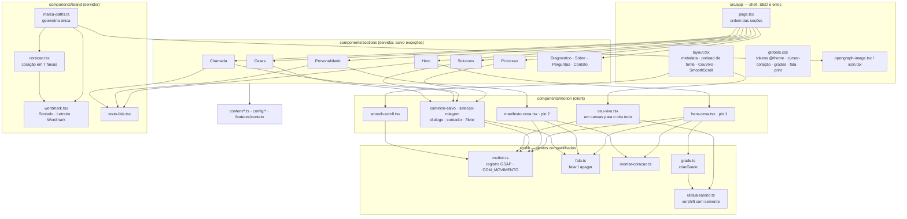
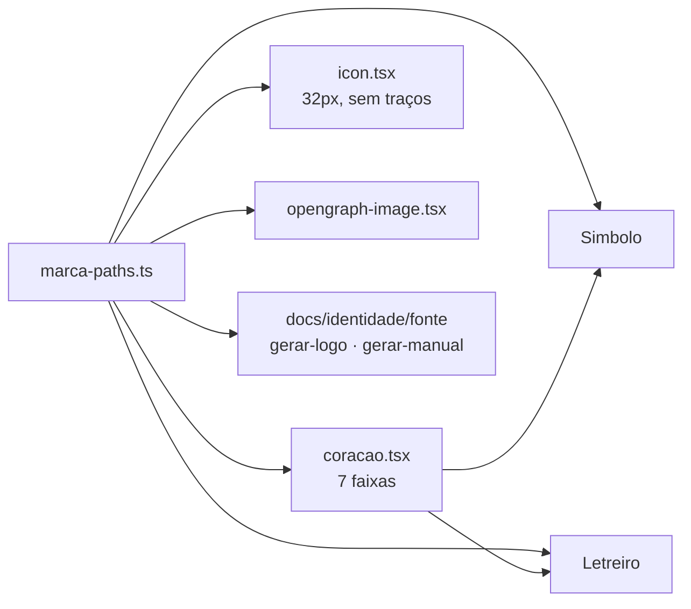
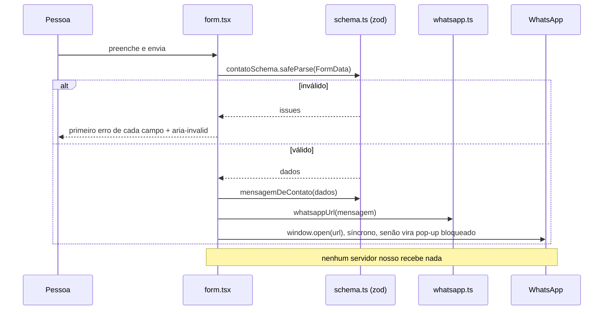
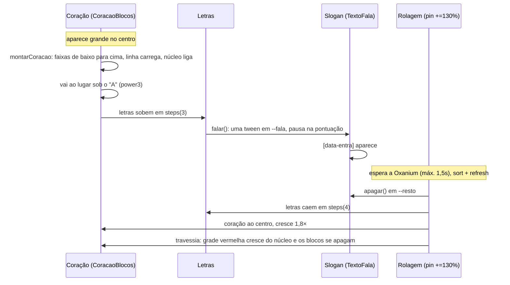

# Mapa do código — DETERA

> Gerado pelo Cartographer. Último mapeamento: 28/09/2026, 11:39 UTC (v2: movimento próprio inspirado em Undertale).

Site institucional de página única da DETERA. Next.js 16 (App Router + Turbopack), React 19, TypeScript estrito, Tailwind CSS v4, GSAP + ScrollTrigger + Lenis (pelo npm; a CSP bloqueia CDN). Tudo é pré-renderizado estático; não existe backend, rota de API nem banco. O formulário de contato monta a mensagem e abre o WhatsApp, sem nada sair do navegador para um servidor nosso.

A v2 trocou a coreografia inteira por uma **identidade de movimento** tirada do próprio nome (DET = DETERMINAÇÃO, referência a Undertale): o coração se monta em placas, a linha de energia carrega, o texto é "falado" letra a letra, um cursor-coração marca a escolha, etapas lidas ficam "salvas". O plano aprovado está em [design-plan.md](design-plan.md) e o manual da marca em [identidade/](identidade/README.md).

## Visão geral


```mermaid
graph TB
    subgraph App["src/app — shell, SEO e erros"]
        Layout[layout.tsx<br/>metadata · preload da fonte · CeuVivo · SmoothScroll]
        Page[page.tsx<br/>ordem das seções]
        CSS[globals.css<br/>tokens @theme · cursor-coração · grades · fala · print]
        OG[opengraph-image.tsx / icon.tsx]
    end

    subgraph Movimento["components/motion (client)"]
        Ceu[ceu-vivo.tsx<br/>um canvas para o céu todo]
        Lenis[smooth-scroll.tsx]
        HeroCena[hero-cena.tsx · pin 1]
        Manifesto[manifesto-cena.tsx · pin 2]
        Outros[caminho-salvo · selecao-rolagem<br/>dialogo · contador · filete]
    end

    subgraph Gestos["src/lib — gestos compartilhados"]
        Motion[motion.ts<br/>registro GSAP · COM_MOVIMENTO]
        Fala[fala.ts<br/>falar / apagar]
        Montar[montar-coracao.ts]
        Grade[grade.ts<br/>criarGrade]
        Aleat[utils/aleatorio.ts<br/>xorshift com semente]
    end

    subgraph Marca["components/brand (servidor)"]
        Paths[marca-paths.ts<br/>geometria única]
        Coracao[coracao.tsx<br/>coração em 7 faixas]
        Wordmark[wordmark.tsx<br/>Simbolo · Letreiro · Wordmark]
        TextoFala[texto-fala.tsx]
    end

    subgraph Secoes["components/sections (servidor, salvo exceções)"]
        Hero & Personalidade & Processo & Solucoes & Chamada & Cases
        Resto[Diagnostico · Sobre · Perguntas · Contato]
    end

    Dados[content/*.ts · config/* · features/contato]

    Layout --> Ceu & Lenis
    Page --> Hero & Cases & Solucoes & Personalidade & Processo & Chamada & Resto
    Hero --> HeroCena
    Personalidade --> Manifesto
    Processo & Solucoes & Chamada & Cases --> Outros
    HeroCena --> Fala & Montar & Grade
    Manifesto --> Fala & Montar
    Outros --> Fala
    Ceu & Grade --> Aleat
    HeroCena & Manifesto & Outros & Ceu & Lenis --> Motion
    Paths --> Coracao & Wordmark & OG
    Coracao --> Wordmark
    Hero & Personalidade & Chamada --> TextoFala
    Secoes --> Dados
```

A dependência corre num sentido só: `page → sections → motion/brand/ui → lib → content/config`. Nada em `content/`, `config/` ou `lib/` importa de `components/`. As seções continuam sendo componentes de servidor: o movimento entra por um invólucro client (`HeroCena`, `ManifestoCena`, `CaminhoSalvo`…) que recebe a seção como `children` e acha o que animar por `data-*`.

## Estrutura de diretórios

```
deteratestepremium/
├── next.config.ts          # CSP, headers de segurança, redirects das URLs antigas — função da fase, não do NODE_ENV
├── README.md               # decisões de marca e produto
├── .env.example            # NEXT_PUBLIC_SITE_URL, NEXT_PUBLIC_WHATSAPP_NUMBER
├── public/
│   ├── cases/              # fotos dos cases, copiadas (não hotlinkadas)
│   └── fonts/              # Oxanium variável, latin + latin-ext (woff2)
├── docs/
│   ├── CODEBASE_MAP.md     # este arquivo
│   ├── design-plan.md      # plano v2 aprovado: paleta, contraste WCAG, identidade de movimento, mapa de seções
│   └── identidade/         # manual da marca (PDF, DOCX), logo em SVG/PNG e o código que gera tudo
└── src/
    ├── app/                # layout, página, CSS global, erros, favicon, imagem OG, robots, sitemap
    ├── components/
    │   ├── brand/          # geometria, coração em faixas, símbolo, nome desenhado, texto falado
    │   ├── layout/         # header (client) e footer
    │   ├── motion/         # céu em canvas, Lenis e as coreografias (client)
    │   ├── sections/       # uma seção por arquivo + nave + prévia de case
    │   └── ui/             # button, container, section, ícones em pixel
    ├── config/             # site.ts (identidade e contato) e nav.ts
    ├── content/            # todo o texto das seções, separado da apresentação
    ├── features/contato/   # formulário + schema zod + montagem da mensagem
    └── lib/                # motion.ts, fala.ts, grade.ts, montar-coracao.ts, seo/json-ld e utils
```

Fora do produto: `.claude/launch.json` (servidores do preview: `dev` e `site-producao` na porta 3100) e a skill `frontend-design`, versionada em `.agents/skills/` com o `skills-lock.json`.

## Guia por módulo

### `src/app/` — shell, SEO e erros

| Arquivo | Função | Tokens |
|---|---|---|
| `layout.tsx` | HTML raiz, `metadata`, `viewport`, preload de `/fonts/oxanium-latin.woff2`, monta `<CeuVivo />` antes dos filhos e `<SmoothScroll />` depois, Vercel Analytics/Speed Insights, recado no console | 1272 |
| `page.tsx` | Compõe a página inteira, na ordem do argumento de venda | 448 |
| `globals.css` | Tokens `@theme`, `@font-face` da Oxanium, cursor-coração, grades de blocos, fala, palco do manifesto, keyframes, impressão, movimento reduzido | 8591 |
| `error.tsx` | Erro de segmento (client). Mostra só o `digest`, nunca a pilha | 564 |
| `global-error.tsx` | Erro no próprio layout (client). Cores fixas em linha: o CSS pode não ter carregado | 591 |
| `not-found.tsx` | 404 com `noindex` | 340 |
| `icon.tsx` | Favicon 32px via `next/og`, subconjunto da geometria (sem os traços) | 420 |
| `opengraph-image.tsx` | Imagem de compartilhamento 1200×630 | 1052 |
| `robots.ts` / `sitemap.ts` | Bloqueiam tudo sem domínio público; sitemap de uma URL só | 248 |

**Ordem da página e densidade do céu** (`data-ceu`, de 0 a 1, lida pelo `CeuVivo`):

| # | Seção | `id` | Fundo | `ceu` |
|---|---|---|---|---|
| 1 | `Hero` | `topo` | vazio | 1 |
| 2 | `Cases` | `projetos` | camada | 0.35 |
| 3 | `Diagnostico` | `diagnostico` | vazio | 0.55 |
| 4 | `Solucoes` | `solucoes` (alias `servicos`) | camada | 0.2 |
| 5 | `Personalidade` | `personalidade` | vazio | 0.85 |
| 6 | `Processo` | `processo` (alias `como-funciona`) | camada | 0.2 |
| 7 | `Chamada` | — | vazio | 0.5 |
| 8 | `Sobre` | `sobre` | camada | 0.45 |
| 9 | `Perguntas` | `perguntas` | vazio | 0.15 |
| 10 | `Contato` | `contato` | camada | 0.8 |
| — | `Footer` | — | transparente | 0.25 |

Antes vêm o link "Pular para o conteúdo" e o `Header`; depois, `EmpresaJsonLd` + `PerguntasJsonLd`. A curva do céu é forte nos momentos (hero, manifesto, contato) e quase apagada onde se lê muito. `vazio` é transparente (o céu aparece); `camada` é `bg-camada/90`.

### `src/components/brand/` — a marca

Nenhum é client. O que se move é animado de fora, por `data-*`.

| Arquivo | Função | Tokens |
|---|---|---|
| `marca-paths.ts` | Fonte única da geometria: `NOME_DETERA` (6 letras traçadas à mão, várias com `evenodd`), `NOME_DETERA_VIEWBOX` (`0 0 716 202`), `ALTURA_LETRAS` (128), `MARCA_METADE`, `MARCA_NUCLEO`, `MARCA_LINHA`, `MARCA_TRACOS` (sistema `0 0 32 40`) | 1299 |
| `coracao.tsx` | `CoracaoBlocos({ id })`: o coração recortado em `FAIXAS_DO_CORACAO` (7) faixas por `clipPath`, metade direita espelhada. Marca `data-bloco` (+ `data-faixa`, `data-lado`), `data-linha`, `data-traco`, `data-nucleo` | 939 |
| `wordmark.tsx` | `Simbolo`, `Letreiro`, `Wordmark` (abaixo) | 1620 |
| `texto-fala.tsx` | `TextoFala({ texto })`: cópia `sr-only` + `<span aria-hidden data-fala>` com um `<span data-fala-letra style="--i:n">` por caractere visível | 508 |

**Modos do `Simbolo({ className, vivo, montavel })`**
- parado (padrão): paths estáticos. Rodapé, erro, 404.
- `vivo`: ganha `.marca-viva` (placas respirando, núcleo pulsando, traços piscando, tudo em CSS). **Só o cabeçalho.**
- `montavel="<id>"`: renderiza `CoracaoBlocos` com esse prefixo de `clipPath`, para `montarCoracao`. Usado no fecho do manifesto (`fecho-coracao`).

**Modos do `Letreiro({ className, animado })`**
- sem `animado`: `viewBox 0 0 716 128`, sem o espaço do coração (alinha no rodapé).
- `animado` (só no hero): `viewBox 0 0 716 202`; cada letra é `<g data-letra-desfaz><g data-letra-entra>` (rolagem por fora, entrada por dentro) e o coração sob o "A" é `<g data-hero-coracao><g data-coracao-entra>` com `CoracaoBlocos id="hero-coracao"`.

`Wordmark({ tamanho })` = `Simbolo` parado + `Letreiro` sem animação.


```mermaid
graph LR
    P[marca-paths.ts] --> C[coracao.tsx<br/>7 faixas]
    P --> S[Simbolo]
    P --> L[Letreiro]
    C --> S & L
    P --> I[icon.tsx<br/>32px, sem traços]
    P --> O[opengraph-image.tsx]
    P --> G[docs/identidade/fonte<br/>gerar-logo · gerar-manual]
```

Os destinos não compartilham runtime, só esse arquivo. Mudou a marca, confira todos e gere o manual de novo.

### `src/components/motion/` — a coreografia

Todos client, com `useGSAP` e `gsap.matchMedia(...)`. Com movimento reduzido quase nada é criado e o HTML do servidor vale como está (exceções na tabela). Recebem o conteúdo como `children` e acham o que animar por `data-*`, não por classe de estilo.

| Arquivo | Função | Tokens |
|---|---|---|
| `ceu-vivo.tsx` | **Um único `<canvas class="ceu-vivo">`** fixo atrás da página, no lugar das 174 estrelas animadas em CSS da v1. 90 a 260 estrelas conforme a área, 3 camadas de profundidade, rastro proporcional à velocidade da rolagem, cintilar em 5 degraus. Densidade por seção lida de `[data-ceu]` (usa o `.pin-spacer` como posição real das seções fixadas), remedida só no `refresh` do ScrollTrigger. PRNG `criarGerador(20260927)`. DPR limitado (1,5 celular / 2 desktop), ~30 fps parado, pausa com a aba oculta, ignora mudança de altura pequena no celular (barra do navegador). Movimento reduzido: desenha uma vez, parado | 2851 |
| `smooth-scroll.tsx` | Lenis no ticker do GSAP (`lagSmoothing(0)`), `fonts.ready → ScrollTrigger.refresh()`. Âncoras: `lenis.start()` (o menu para o Lenis), destino é o `.pin-spacer` se houver, **sem `offset`** (o Lenis já desconta `scroll-padding-top`), `pushState`, foco com `tabindex=-1` num `setTimeout 0` (o `<main>` ainda pode estar `inert`). Movimento reduzido: sem Lenis, rolagem nativa | 923 |
| `hero-cena.tsx` | **Pin 1.** Entrada: o coração aparece grande no centro, se monta (`montarCoracao`) e vai ao lugar sob o "A"; as letras sobem em `steps(3)`; o slogan é falado; `[data-entra]` aparece. Rolagem (`+=130%`, `scrub`, `anticipatePin`): apaga o slogan, derruba as letras em `steps(4)`, leva o coração ao centro e faz a **travessia do núcleo** (grade vermelha de `criarGrade` cresce a partir do núcleo e os blocos se apagam). Marco `data-fim-do-hero` para o cabeçalho | 3037 |
| `manifesto-cena.tsx` | **Pin 2** (`+=240%`), só com movimento e `min-height: 560px`. Põe `.manifesto--palco`. **A fala anda por tempo, não pela rolagem**: a timeline fica pausada e persegue, no próprio ritmo (0,028 s por letra, 1,3 s de leitura), a página do diálogo que a rolagem pede (o trecho é dividido em uma faixa por par + o fecho). Se a pessoa chega ao fim do trecho antes de a fala acabar, a página segura ali até a última frase; rolar de novo durante a espera acelera a fala 3×, e subir solta. Segura a roda pelo Lenis (`definirRetencao`), o dedo com `html.rolagem-retida` (`overflow: hidden`, só em tela de toque) e o teclado; âncora atravessa sem segurar (`marcarNavegacao`) | 1284 |
| `caminho-salvo.tsx` | Processo: cada `[data-etapa]` a 60% da tela ganha `data-selecionada`/`data-salvo` (troca instantânea). A partir de 768px, o coração `[data-volta-alma]` percorre o laço 05 → 01 em degraus, com as pernas medidas de `.ciclo-volta` (`invalidateOnRefresh`) | 928 |
| `selecao-rolagem.tsx` | Soluções: o cursor-coração segue a entrega que está sendo lida. ≥768px: ScrollTrigger por `[data-entrega]` a 55%. <768px: `IntersectionObserver` (0,7) dentro de cada `.deslize`. **Roda também com movimento reduzido** (é troca de estado, não animação) | 610 |
| `dialogo.tsx` | Chamada: a 70% da tela, fala `[data-dialogo-fala]` e mostra `[data-dialogo-resto]`. Por tempo, uma vez só (`once`), não volta ao subir | 412 |
| `contador.tsx` | Nota do PageSpeed contando até o valor medido em `steps(10)`, `start: "top bottom"` e `once`. O HTML já traz o valor final | 482 |
| `filete.tsx` | Linha do Diagnóstico desenhada por `scaleX` em 16 degraus, `scrub` entre 92% e 62% | 326 |

**Trechos fixados**: só o hero e o manifesto (a regra é no máximo dois).

- Hero: fixa se `(min-height: 560px)` **e** o palco cabe na tela (`offsetHeight <= innerHeight + 24`). Senão, rola sem pin (`end: "60% top"`), só apagando e desfazendo, sem travessia.
- Manifesto: sem movimento ou com tela baixa, fica a lista lida em HTML puro.

### `src/lib/` — os gestos compartilhados

| Arquivo | Função | Tokens |
|---|---|---|
| `motion.ts` | Registra ScrollTrigger e `useGSAP` (só no navegador), `ScrollTrigger.config({ ignoreMobileResize: true })`, expõe `window.ScrollTrigger` para os scripts de QA. Exporta `definirLenis`, `obterLenis`, `definirRetencao`/`retem` (um trecho pede para a roda não passar dele), `marcarNavegacao`/`estaNavegando` (âncora em curso), `prefereMenosMovimento`, `COM_MOVIMENTO`, `gsap`, `ScrollTrigger`, `useGSAP` | 513 |
| `fala.ts` | `falar(tl, bloco, { inicio, porLetra, pausa })` e `apagar(...)`: **uma** tween por bloco conduz um relógio numérico gravado em `--fala` (ou `--resto`), com pausa extra depois de `.,;:!?`. Reaplica no `onReverseComplete` para o `scrub` voltar certo. Devolve o tempo final | 825 |
| `montar-coracao.ts` | `montarCoracao(tl, raiz, { inicio, passo })`: faixas de baixo para cima, esquerda antes da direita, em `steps(2)`; depois a linha carrega (`steps(6)`), os traços acendem e o núcleo liga (`steps(3)`). Devolve o tempo final | 741 |
| `grade.ts` | `criarGrade(conteiner, { lado, semente, classe })`: cria os `<span class="grade-bloco">` direto no DOM (medidos na hora e disponíveis no mesmo quadro do `useGSAP`), grava `--grade-colunas`/`--grade-linhas`, devolve `{ blocos, remover }` com os blocos já na ordem sorteada. Usado por hero (travessia), prévia dos cases (montagem) e menu | 498 |
| `utils/aleatorio.ts` | `criarGerador(semente)` (xorshift) e `ordemSorteada(n, semente)` | 306 |
| `seo/json-ld.tsx` | `EmpresaJsonLd` (`ProfessionalService` com catálogo vindo de `pilares`) e `PerguntasJsonLd` (`FAQPage`); `serializar()` escapa `<` | 789 |
| `utils/cn.ts` | Junta classes e resolve conflito de Tailwind com `twMerge` | 166 |
| `utils/env.ts` | `env()`: string vazia conta como ausente (é assim que a Vercel entrega variável declarada e não preenchida) | 90 |
| `utils/whatsapp.ts` | `whatsappUrl(texto)` → `https://wa.me/{numero}?text=…` | 112 |

### `src/components/layout/`

| Arquivo | Função | Tokens |
|---|---|---|
| `header.tsx` | Client. Fixo; transparente no hero e sólido (`border-borda bg-vazio`, sem blur) depois, por `IntersectionObserver` no marco `data-fim-do-hero` com `rootMargin "100000px 0px -2px 0px"`. `Simbolo vivo`, links `.escolha`, CTA de WhatsApp. Menu mobile em tela cheia abaixo do cabeçalho, com preenchimento em blocos (`criarGrade`, `.grade-menu`); abre com Lenis parado + `overflow: hidden`, `inert` em `main`/`footer`/pular-conteúdo, Esc devolve o foco ao botão, fecha sem animação | 2502 |
| `footer.tsx` | Servidor. `data-ceu 0.25`, transparente, fecha a trilha (`trilha--fim`). `Wordmark`, navegação, canais, ícones em pixel, "Goiânia, GO", linha legal com o fundador | 1163 |

### `src/components/sections/`

| Arquivo | Função | Invólucro / ganchos | Tokens |
|---|---|---|---|
| `hero.tsx` | 100svh (`.hero-palco`): `Letreiro animado`, slogan em `TextoFala`, CTAs, `TrilhaDeFrentes` (≥768px), `Nave` na margem (≥1680px, por CSS), `<div data-travessia class="travessia">` | `HeroCena`; `data-intro`, `data-entra`, `data-hero-nome/slogan/resto/nave` | 1623 |
| `cases.tsx` | Dois cases com notas medidas do PageSpeed + "Também em obra" em `.deslize`. História em `<details>` com resumo `.escolha`. Datas com `timeZone: "UTC"` | `Contador` | 2601 |
| `case-preview.tsx` | Client. Moldura com o domínio real (`.alma-marca`), fotos em rodízio só por CSS (`.previa-slide`, `CICLO` 6,9s), iframe com `sandbox=""` ou aviso; "Em obra" com `.obra-barra`/`.obra-recado`. A tela **se monta em blocos** na rolagem (`[data-montagem]`, `criarGrade` com semente tirada do domínio, `scrub` de 88% a 42%) | próprio `useGSAP` | 2411 |
| `diagnostico.tsx` | Os quatro sintomas | `Filete` | 363 |
| `solucoes.tsx` | As quatro frentes e suas entregas; cabeçalho da frente fixo por `sticky`; no celular as entregas viram `.deslize` ("Deslize para ver as N entregas"). Colunas em `minmax(0, …)` | `SelecaoRolagem`; `data-entrega`, `.alma-marca` | 1200 |
| `personalidade.tsx` | O manifesto: quatro pares genérico → específico e o fecho com `Simbolo montavel="fecho-coracao"`. A lista é HTML real; o palco é uma camada de CSS por cima | `ManifestoCena`; `data-par`, `data-generico`, `data-especifico`, `data-voz`, `data-progresso-vivo`, `data-fecho*` | 978 |
| `processo.tsx` | Cinco etapas como pontos de salvamento + o laço 05 → 01 (`.ciclo-volta`, só ≥768px) | `CaminhoSalvo`; `data-etapa`, `data-volta-alma`, `data-volta` | 1213 |
| `chamada.tsx` | Caixa de diálogo (`.caixa-dialogo`) com a pergunta falada e duas escolhas (`.escolhas` > `.escolha`, a primeira com `data-selecionada`) | `Dialogo`; `data-dialogo-fala`, `data-dialogo-resto` | 633 |
| `sobre.tsx` | Por que a DETERA existe (inclui a referência a Undertale) + fundador; coluna `sticky` só em CSS | — | 1112 |
| `perguntas.tsx` | FAQ em `<details>` nativo; pergunta com `.escolha`, resposta abre em degraus (`.resposta`) | — | 671 |
| `contato.tsx` | Canais (`.escolha`) + formulário | — | 867 |
| `nave.tsx` | Client. Jogo de nave em canvas na margem do hero (≥1680px), estado do jogo em variáveis do loop, só o placar em `useState` | — | 4494 |

### `src/components/ui/`

| Arquivo | Função | Tokens |
|---|---|---|
| `button.tsx` | `Button`, `ButtonLink` (escolhe `<a>` ou `next/link` pelo href; `target="_blank"` só em http/https), `buttonStyles`; variantes `determinacao`, `contorno`, `fantasma`. Estados em `.btn*` no CSS | 669 |
| `container.tsx` | Largura: narrow 44rem, default 76rem, wide 88rem | 191 |
| `section.tsx` | Fundo (`vazio` transparente / `camada` `bg-camada/90`), respiro vertical, `data-ceu` (padrão 0.3), trilha, `alias` para âncoras antigas | 632 |
| `icones.tsx` | Ícones em pixel numa grade 10×10 (`crispEdges`, sem traço nem curva): `IconeWhatsapp`, `IconeEmail`, `IconeLinkedin`, `IconeGithub`, `IconeLinkExterno`. O gerador do manual lê as tuplas `[x, y, w, h]` daqui | 1301 |

### `src/config/`

| Arquivo | Função | Tokens |
|---|---|---|
| `site.ts` | `site` (nome, slogan, contato, fundador, URL), `isPublicDomain`, `resolveSiteUrl()` | 703 |
| `nav.ts` | `navLinks`, usado por header e footer | 169 |

### `src/content/` — todo o texto

| Arquivo | Exporta | Usado por | Tokens |
|---|---|---|---|
| `cases.ts` | `Case`, `Medicao`, `ImagemPrevia`, `cases` | `cases.tsx`, `case-preview.tsx` | 2160 |
| `pilares.ts` | `Pilar`, `Entrega`, `pilares` | `hero.tsx`, `solucoes.tsx`, `json-ld.tsx` | 1794 |
| `processo.ts` | `etapas` | `processo.tsx` | 403 |
| `perguntas.ts` | `perguntas` | `perguntas.tsx`, `json-ld.tsx` | 589 |
| `diagnostico.ts` | `sintomas` | `diagnostico.tsx` | 310 |
| `personalidade.ts` | `transformacoes` | `personalidade.tsx` | 322 |
| `em-construcao.ts` | `ProjetoEmConstrucao`, `projetosEmConstrucao` | `cases.tsx` | 507 |

`pilares[].acento` decide a cor: só `infraestrutura` é `sistema` (azul), "a única frente que não vende movimento, e sim permanência". `cases[].medicao` guarda as notas do PageSpeed com o link permanente do relatório; `impacto` é qualitativo de propósito.

### `src/features/contato/`

| Arquivo | Função | Tokens |
|---|---|---|
| `schema.ts` | `contatoSchema` (zod, limite superior em todo campo), `tiposDeProjeto`, `mensagemDeContato()` | 572 |
| `form.tsx` | Client. `FormularioContato`: valida no cliente e abre o WhatsApp; rótulos com `.alma-marca` e o coração aparece no campo em foco (`.campo-grupo`) | 1118 |

### `docs/identidade/` — manual da marca

| Arquivo | Função | Tokens |
|---|---|---|
| `README.md` | O que cada arquivo é, estado do Figma e como gerar de novo | 600 |
| `fonte/conteudo.mjs` | **Todo o texto do manual**, sem formato: o PDF e o DOCX importam o mesmo módulo | 5709 |
| `fonte/gerar-logo.mjs` | SVGs do logo lidos de `marca-paths.ts` por regex (símbolo, letreiro, letreiro de apresentação, assinatura × escuro/claro/mono-claro/mono-escuro, mais a alma) | 1328 |
| `fonte/png.mjs` | Rasteriza 11 SVGs em PNG no Chrome headless (CDP por WebSocket, sem Puppeteer) | 1194 |
| `fonte/gerar-manual.mjs` | HTML de 19 páginas A4 paisagem; lê os SVGs, as fotos, a Oxanium de `public/fonts`, a geometria e os ícones de `icones.tsx` | 10497 |
| `fonte/imprimir.mjs` | HTML → PDF (`Page.printToPDF`) + um JPEG por página para conferência; avisa se a Oxanium carregou | 891 |
| `fonte/gerar-docx.mjs` | DOCX A4 retrato em fundo claro, com `docx@9` e os PNGs | — |

Ordem para gerar: `gerar-logo` → `png` → `gerar-manual` → `imprimir`, e `gerar-docx` depois do `png`. O Figma (arquivo `i5eEIvW5HUH8QErDNPo9Fv`) tem as variáveis de cor, os estilos de texto, o logo como componentes e as pranchas 01 a 08; as pranchas 09 a 13 estão em `figma-pendente/` como imagem.

## Fluxos

### Contato


```mermaid
sequenceDiagram
    participant P as Pessoa
    participant F as form.tsx
    participant Z as schema.ts (zod)
    participant W as whatsapp.ts
    participant WA as WhatsApp

    P->>F: preenche e envia
    F->>Z: contatoSchema.safeParse(FormData)
    alt inválido
        Z-->>F: issues
        F-->>P: primeiro erro de cada campo + aria-invalid
    else válido
        Z-->>F: dados
        F->>Z: mensagemDeContato(dados)
        F->>W: whatsappUrl(mensagem)
        F->>WA: window.open(url), síncrono, senão vira pop-up bloqueado
    end
    Note over F,WA: nenhum servidor nosso recebe nada
```

Todo CTA do site monta o seu próprio `whatsappUrl(...)` com uma mensagem diferente, para a conversa já começar sabendo de onde a pessoa veio.

### Hero: entrada e travessia


```mermaid
sequenceDiagram
    participant C as Coração (CoracaoBlocos)
    participant L as Letras
    participant S as Slogan (TextoFala)
    participant R as Rolagem (pin +=130%)
    Note over C: aparece grande no centro
    C->>C: montarCoracao: faixas de baixo para cima, linha carrega, núcleo liga
    C->>C: vai ao lugar sob o "A" (power3)
    C->>L: letras sobem em steps(3)
    L->>S: falar(): uma tween em --fala, pausa na pontuação
    S->>S: [data-entra] aparece
    Note over R: espera a Oxanium (máx. 1,5s), sort + refresh
    R->>S: apagar() em --resto
    R->>L: letras caem em steps(4)
    R->>C: coração ao centro, cresce 1,8×
    R->>C: travessia: grade vermelha cresce do núcleo e os blocos se apagam
```

### Fala (texto dito letra a letra)

`TextoFala` entrega cada letra com `--i`. O CSS calcula `opacity: clamp(0, min(var(--fala) - var(--i), var(--resto) - var(--i)), 1)`. `falar()` anima `--fala` de 0 ao total e `apagar()` anima `--resto` do total a 0. Sem JavaScript, as duas variáveis valem 100000 e o texto está inteiro. Isso trocou 1100+ tweens e dois spans por letra da primeira versão por uma tween por bloco.

## Tokens de design (`globals.css`, `@theme`)

**Cores**
- Superfícies: `vazio #07080b`, `camada #0e1015`, `camada-alta #161920`, `borda #23262e`, `borda-viva #363b45`, `contorno #606671` (borda de elemento interativo, 3:1 da WCAG 1.4.11 sobre `camada-alta`).
- Texto: `texto #f2f3f5`, `texto-suave #9ba1ac`, `texto-fraco #7c828e` (clareado na v2 para passar 4.5:1 também sobre `camada-alta`).
- Determinação (ação, núcleo): `determinacao #ff3b3b`, `-viva #ff6b6b`, `-funda #3d0f14`.
- Sistema (infraestrutura, continuidade): `sistema #4c7dff`, `-viva #7ca0ff`, `-funda #10203f`.

A tabela de contraste de cada par texto/fundo, com o tom mais próximo que passa, está em [design-plan.md](design-plan.md).

**Fonte**: Oxanium para display, texto e dados, variável 200–800, servida de `public/fonts` por `@font-face` e pré-carregada no `layout.tsx`.

**Escala**: `marca` → `display` → `subdisplay` → `title` → `heading` → `lead` → `micro` (espaçamento 0.02em).

**Forma e ritmo**: `--radius-min 2px`, `--radius-bloco 4px`; `steps(n)` para tudo que é pixel; `power3` só para deslocamento grande; o cursor salta, sem curva.

**Classes e ganchos que importam**

| Classe / atributo | Função |
|---|---|
| `--alma` | Máscara SVG do coração em data-URI, reusada por todo coração de cursor |
| `.escolha`, `.alma-marca` | **Cursor-coração**: o `::before` com a máscara aparece em hover, foco, `:focus-within` ou quando o item (ou o pai) tem `data-selecionada`. Substitui o hover genérico em todo o site |
| `.escolhas` | Grupo: o coração sai da escolha padrão quando outra recebe hover/foco |
| `.alma` | O coração como elemento (voz do manifesto, etapas do processo, laço) |
| `[data-fala]`, `[data-fala-letra]` | Fala por variável CSS (`--fala`, `--resto`, `--i`) |
| `.travessia`, `.montagem`, `.grade-menu`, `.grade-bloco` | Grades de blocos de `criarGrade` (`--grade-colunas`/`--grade-linhas`) |
| `.ceu-vivo` | O canvas do céu: `fixed`, `z-index: -1`, `height: 100lvh` |
| `[data-intro]` | Escondido até o `HeroCena` mostrar; rede de segurança por keyframe depois de 3,5s se o JS não rodar (desligada com movimento reduzido) |
| `.manifesto--palco`, `.manifesto__*` | Palco do manifesto fixado, só em `@media screen` |
| `.etapa__*`, `[data-salvo]` | Pontos de salvamento do processo |
| `.deslize` | Carrossel nativo com `scroll-snap`, só abaixo de 768px. Dentro de grade, o item precisa de `min-w-0` |
| `.caixa-dialogo` | Caixa de diálogo da Chamada |
| `.marca-viva` e filhas | A marca viva do cabeçalho |
| `.trilha`, `.trilha--fim` | Linha vertical com nó que atravessa a página (≥1280px) |
| `.btn--*`, `.campo`, `.campo-grupo`, `.estado` | Botões, campos (com `aria-invalid`), rótulo curto de estado real |

**Keyframes que sobraram**: `marca-respira-esq/-dir`, `marca-nucleo-pulsa`, `marca-traco-pisca` (`.marca-viva`), `previa-troca` (rodízio de fotos), `obra-barra` e `obra-recado` (prévia em obra), `rede-de-seguranca` (`[data-intro]`), `desenhar-volta` (`.ciclo-volta`, em `@supports (animation-timeline: view())`), `resposta-abre` (FAQ).

**Movimento reduzido**: a regra global zera duração e atraso de toda animação e transição; os componentes do GSAP não criam nada fora de `COM_MOVIMENTO`; o céu desenha parado e o Lenis não liga. O que se vê é o estado final.

**Impressão**: `@media print` força entrada, letras, coração, blocos e `.ciclo-volta` no estado final, reseta `--fala`/`--resto` para mostrar tudo e esconde `.ceu-vivo`, as grades e os corações de cursor.

## Segurança e infraestrutura

`next.config.ts` exporta uma função da **fase** do Next (`PHASE_DEVELOPMENT_SERVER`), não um objeto que lê `NODE_ENV`: uma versão antiga assim vazou `'unsafe-eval'` para produção.

| Diretiva | Valor | O que isso impõe ao código |
|---|---|---|
| `script-src` | `'self' 'unsafe-inline'` (+ `'unsafe-eval'` e Vercel só em dev) | Scripts em linha permitidos sem nonce (nonce exigiria middleware e mataria o estático). Os dois scripts próprios, recado do console e JSON-LD, escapam `<`. GSAP e Lenis vêm do bundle, nunca de CDN |
| `style-src` | `'self' 'unsafe-inline'` | Estilo em linha liberado (variáveis CSS via `style`) |
| `img-src` | `'self' data: https://yasmin-g-studio.vercel.app` | Imagem externa só dessa origem; o resto vai para `public/` |
| `font-src` | `'self'` | Fonte tem que ser auto-hospedada |
| `frame-src` | `https://keepnew.vercel.app` | Único iframe permitido |
| `connect-src` | `'self'` (+ `ws:`/`wss:` em dev) | Nenhum fetch para terceiros |
| `form-action`, `base-uri` | `'self'` | — |
| `object-src`, `frame-ancestors` | `'none'` | O site não pode ser embutido |

Outros headers: `X-Content-Type-Options: nosniff`, `Referrer-Policy: strict-origin-when-cross-origin`, `X-Frame-Options: DENY`, `Permissions-Policy` restritiva, `Strict-Transport-Security: max-age=63072000; includeSubDomains`, **sem `preload`**, de propósito (entrar na lista é praticamente irreversível).

Redirects temporários (307, para o navegador não cachear uma decisão ainda em ajuste): `/sobre`, `/servicos`, `/solucoes`, `/projetos`, `/como-funciona`, `/processo`, `/contato` → âncoras da home.

Deploy: repositório `SamuelcCouto/detera-premium`, publicado pela Vercel a cada push em `main` (https://detera-premium-ten.vercel.app). É um projeto separado da DETERA oficial (`C:\ProjetosCloudSpyre\detera`, detera.com.br).

## Variáveis de ambiente

| Variável | Lida em | Sem ela |
|---|---|---|
| `NEXT_PUBLIC_SITE_URL` | `config/site.ts` | `isPublicDomain = false` → `noindex` em `layout.tsx` e `disallow: /` em `robots.ts`. **O site não é indexado** |
| `NEXT_PUBLIC_WHATSAPP_NUMBER` | `config/site.ts` | Cai no número fixo no código |
| `VERCEL_PROJECT_PRODUCTION_URL` | `config/site.ts` | Injetada pela Vercel; senão `http://localhost:3000` |

Toda leitura passa por `env()`, que trata string vazia como ausente.

## Código que roda no cliente

| Componente | Por quê |
|---|---|
| `app/error.tsx`, `app/global-error.tsx` | Error boundary do Next tem que ser client |
| `layout/header.tsx` | Estado sólido, menu mobile, trava de rolagem, `inert`, Esc, grade do menu |
| `sections/nave.tsx` | Canvas, `requestAnimationFrame`, teclado, `ResizeObserver` |
| `sections/case-preview.tsx` | Fallback de imagem/iframe e montagem em blocos |
| `components/motion/*` | Céu em canvas, Lenis e as coreografias do GSAP |
| `features/contato/form.tsx` | Validação e `window.open` |

Todo o resto (a marca, as seções, os botões, os ícones) é renderizado no servidor.

## Convenções

- **Português em tudo**: identificadores, props, campos de conteúdo e comentários (`Simbolo`, `criarGrade`, `falar`, `entregas`). Só os primitivos de UI ficam em inglês (`Button`, `Container`, `Section`).
- **Comentário explica a alternativa rejeitada**: o padrão dominante é "antes era X, deu Y, por isso Z". Leia o comentário antes de "simplificar" algo que parece estranho.
- **Texto fora do componente**: cada seção é um renderizador fino sobre um arquivo de `src/content/`.
- **Aleatoriedade determinística**: nunca `Math.random()` no que roda no servidor. Céu e grades usam `criarGerador`/`ordemSorteada` com semente (`nave.tsx` pode usar `Math.random()`: roda só no cliente, depois do clique).
- **Movimento por `data-*`**, estilo por classe. O CSS pode mudar sem quebrar a coreografia.
- **Gestos da marca, não do catálogo**: sem blur, neon, cortina do centro, surgir-e-subir genérico, mola/elástico, gradiente ou vidro. Degraus (`steps`) para o que é pixel. Detalhes em [design-plan.md](design-plan.md).
- **Uma animação por elemento**: entrada por dentro, rolagem por fora (`data-letra-entra` dentro de `data-letra-desfaz`, `data-coracao-entra` dentro de `data-hero-coracao`).
- **HTML nativo antes de widget**: `<details>` no FAQ e na história do case, `<dl>` nas notas, `<ol>` só onde a ordem importa.
- **Acessibilidade**: `aria-hidden` em toda decoração; `sr-only` para o texto falado; `role="img" aria-label` no nome desenhado; `role="status" aria-live="polite"` no formulário; foco visível global; o cursor-coração também segue o foco do teclado.
- **Número só se for medido**: nenhum cliente, métrica ou certificação inventados. O único número dos cases é o PageSpeed, com o link do relatório.

## Armadilhas

1. **Oxanium não vai por `next/font`.** O carregador do Turbopack não resolve os arquivos dela aqui; o `@font-face` em `globals.css` é o contorno.
2. **"DETERA" com A latino (U+0041)**, nunca o cirílico А (U+0410). Os dois são idênticos na tela; o cirílico quebra busca, leitor de tela e copiar/colar.
3. **Sem `NEXT_PUBLIC_SITE_URL` o site sai com `noindex`.** Intencional para URLs de preview, e a primeira coisa a checar se o Google não indexar.
4. **O pin do hero depende da altura com a fonte certa.** `hero-cena.tsx` espera a Oxanium (no máximo 1,5s) antes de decidir o pin e roda `ScrollTrigger.sort()` + `refresh()`. A folga de 24px e o espaçamento apertado existem para 1280×720 fixar; aumentar o respiro do hero pode desligar o pin em notebook.
5. **`smoothOrigin` do GSAP desloca o núcleo.** Em `montarCoracao`, `transformOrigin` vai no `from` e no `to`. Tirar do `from` faz o núcleo nascer fora do centro.
6. **Emenda entre faixas do coração.** Os retângulos de recorte sobrepõem 0,1 unidade; com menos, aparece um fio quando o coração cresce na travessia.
7. **`tl.set` no tempo 0 aplica na hora.** Por isso `apagar` começa em 0,005 e a fala usa variável CSS; do contrário a última letra do slogan some antes da rolagem.
8. **Lenis já desconta o `scroll-padding-top`.** Passar `offset` em `scrollTo` conta duas vezes. E nada de `scroll-behavior: smooth` no CSS: brigaria com o Lenis.
9. **Âncora para seção fixada mira o `.pin-spacer`**, senão para no meio do trecho fixado.
10. **O cabeçalho é `fixed` e vem antes do pin.** O estado sólido usa `IntersectionObserver` com margem gigante acima, para um salto de âncora que atravessa o marco entre dois quadros não deixar o cabeçalho transparente.
11. **Carrossel dentro de grade estoura a página.** Sem `min-w-0` e colunas em `minmax(0, …)`, o `.deslize` alarga a página no celular.
12. **O `Contador` começa em `top bottom`.** Mais tarde que isso, a nota aparece "0" na borda da tela.
13. **`view()` não anda dentro de trecho fixado.** Nada dentro do hero ou do manifesto usa animação por `view()`; lá quem manda é o GSAP. Animação nova com `view()` vai em `@supports` e entra no bloco `@media print`.
14. **Grades criadas por `criarGrade` não são React.** Sempre chame `remover()` no cleanup do `useGSAP`, senão blocos duplicam ao remontar.
15. **Performance do céu**: animar estrela por DOM foi a causa do travamento da v1 (271 animações infinitas). Estrela nova vai no canvas, não em CSS; e nada de `backdrop-filter`, blur ou grão fixo.
16. **Viewbox do `Letreiro` muda com `animado`** (`202` no hero, `128` no rodapé). Mudou a geometria, confira os dois e o manual.
17. **Imagem externa e iframe exigem CSP.** Prévia nova hotlinkada precisa entrar em `img-src`; iframe novo, em `frame-src` e com `sandbox=""`.
18. **Âncora antiga depende de `alias`**: `#servicos` e `#como-funciona` funcionam pelo `alias` de `Section`, e `/servicos` etc. pelos redirects.
19. **As notas do PageSpeed têm data.** Quando o site do cliente mudar, meça de novo e troque data, notas e link juntos.
20. **O preview oculto do Claude não roda `requestAnimationFrame`.** Céu, jogo e animações de rolagem precisam ser vistos em navegador real ou em captura do Chrome headless.
21. **Retenção do manifesto.** `virtualScroll` do Lenis devolvendo `false` só faz o Lenis ignorar o giro, sem `preventDefault`: o navegador rolava a página sozinho. Por isso `smooth-scroll.tsx` cancela o evento. No toque, um arrasto que já começou tem `touchmove` não cancelável; quem para o dedo é o `overflow: hidden` de `html.rolagem-retida`. E depois de um `lenis.scrollTo(..., { immediate })` o Lenis ignora o próximo evento nativo e fica com a posição velha: para voltar ao limite, primeiro `window.scrollTo`, depois o Lenis. Link de âncora novo que não passe por `smooth-scroll.tsx` precisa chamar `marcarNavegacao(true)`, senão é segurado no manifesto.
22. **`gerar-logo.mjs` lê `marca-paths.ts` por regex** e exige 6 letras e 4 traços; mudar a forma de declarar as constantes quebra o gerador. O sumário do PDF tem números de página fixos em `gerar-manual.mjs`.

## Guia de navegação

- **Mudar o texto de uma seção** → `src/content/<secao>.ts`. O componente quase nunca precisa mudar.
- **Mudar identidade, slogan, e-mail, WhatsApp, fundador** → `src/config/site.ts` (o número também aceita `NEXT_PUBLIC_WHATSAPP_NUMBER`).
- **Adicionar uma seção** → componente em `src/components/sections/`, conteúdo em `src/content/`, entrada em `src/app/page.tsx` na posição do argumento, `ceu` no `Section` conforme o peso do momento, `navLinks` em `src/config/nav.ts` se for para o menu.
- **Fazer um texto ser "falado"** → `TextoFala` na seção e `falar(tl, bloco, …)` de `@/lib/fala` no invólucro de movimento.
- **Montar o coração em outro lugar** → `Simbolo montavel="<id-único>"` e `montarCoracao(tl, raiz, …)`.
- **Efeito de blocos** → `criarGrade` de `@/lib/grade` com uma semente fixa, classe em `globals.css`, `remover()` no cleanup.
- **Marcar escolha com o cursor-coração** → classe `.escolha` (ou `.alma-marca` para rótulo) e, para seleção vinda de rolagem, `data-selecionada` no item.
- **Adicionar um case** → `src/content/cases.ts` + foto em `public/cases/`. Meça no PageSpeed (perfil celular, primeira execução) e preencha `medicao` com o link permanente.
- **Promover projeto "em obra" a case** → mover de `em-construcao.ts` para `cases.ts`; se deixar de ser hotlink/iframe, limpar a origem na CSP em `next.config.ts`.
- **Mudar a marca** → `src/components/brand/marca-paths.ts`; conferir `coracao.tsx`, `wordmark.tsx`, `icon.tsx`, `opengraph-image.tsx` e rodar os geradores de `docs/identidade/fonte`.
- **Mudar cor, fonte, escala, raio** → bloco `@theme` em `src/app/globals.css`; recalcular o contraste em `design-plan.md` e atualizar `docs/identidade/fonte/conteudo.mjs`.
- **Animação conduzida pela rolagem** → componente em `src/components/motion/`, importando de `@/lib/motion`, dentro de `useGSAP` com `gsap.matchMedia(COM_MOVIMENTO)`. Só `transform`, `opacity` e `clip-path`. Conferir no build de produção com captura do Chrome headless.
- **Mudar CSP ou headers** → `next.config.ts`, sempre pelo parâmetro `phase`.
- **Mudar o formulário** → `src/features/contato/schema.ts` (campos, limites, mensagem) e `form.tsx` (UI). Não há servidor; se um dia houver e-mail transacional, o lugar é `src/app/api/`.
- **Mexer em SEO** → `metadata` em `src/app/layout.tsx`, dados estruturados em `src/lib/seo/json-ld.tsx`, indexação por `NEXT_PUBLIC_SITE_URL`.
- **Atualizar o manual da marca** → texto em `docs/identidade/fonte/conteudo.mjs`, depois a sequência do `docs/identidade/README.md`.
